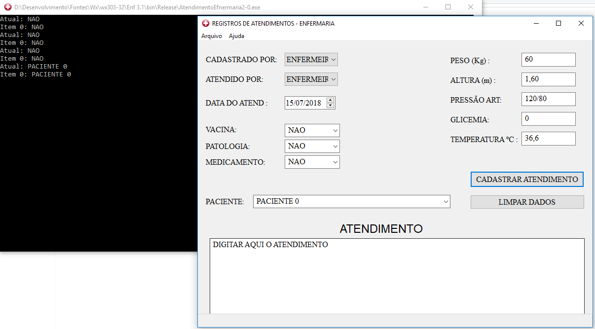
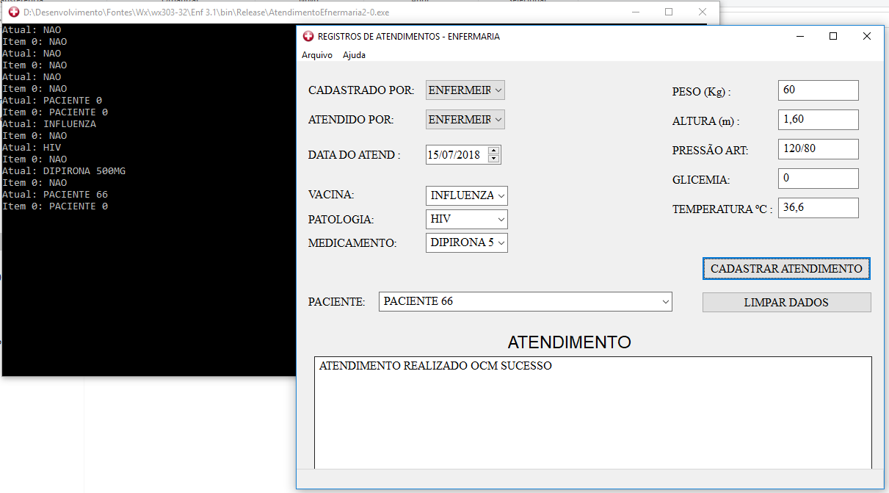

# CadastroEnfermariaWxWidgets
Programa de cadastro simples utilizando arquivos de texto, XML e interface gráfica WxWidgets

Os atendimentos são salvo em arquivos de texto, um arquivo simples contendo os dados do atendimento em formato simples e um arquivo XML contendo os dados do atendimento em um formato mais voltado para bancos de dados

